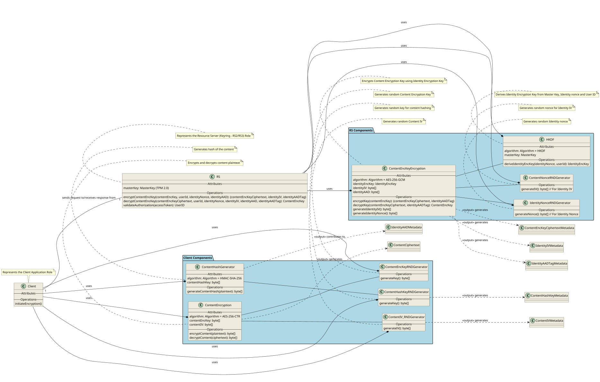
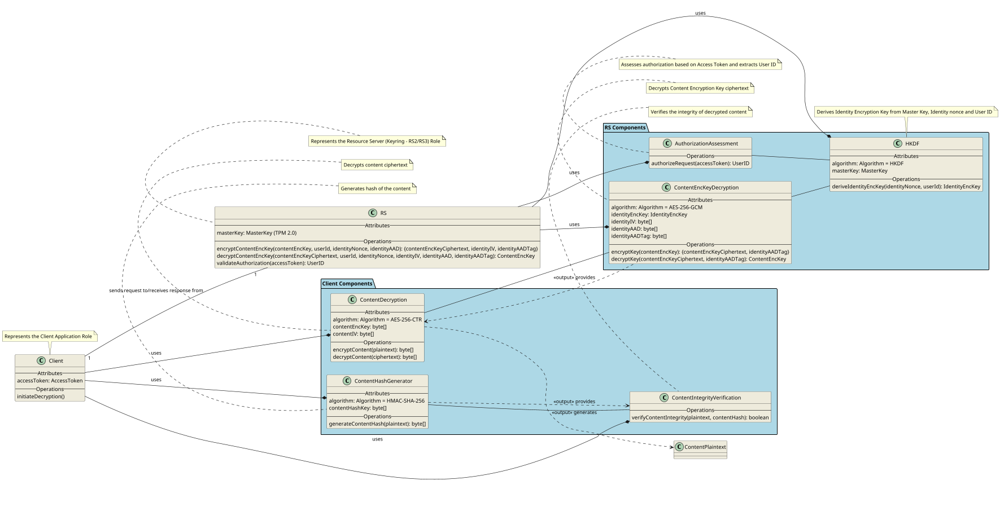

**Class Diagram for Encryption Process:**

**Class Diagram for Decryption Process:**

**Explanation of the Class Diagrams and Assumptions Made:**

* **Classes Represent Participants:** Each "participant" in the sequence diagrams is generally transformed into a class.
* **Packages for Client and RS Components:**  I've grouped the components into "Client Components" and "RS Components" packages to visually separate client-side and server-side classes.
* **Attributes (Inferred):**  I've added attributes to classes where it seemed logical based on their function. For example:
    * Encryption classes (`ContentEncryption`, `ContentEncKeyEncryption`) have `algorithm` attributes to specify the cryptographic algorithm used.
    * `HKDF` and `ContentHashGenerator` also have `algorithm` attributes.
    * `RS` class is shown with `masterKey`.
    * `Client` class in Decryption diagram has `accessToken`.
* **Operations/Methods (Inferred):** I've added operations (methods) to each class based on the actions they perform in the sequence diagrams. For example:
    * `ContentHashGenerator` has `generateContentHash()`.
    * `ContentEncryption` has `encryptContent()` and `decryptContent()`.
    * `HKDF` has `deriveIdentityEncKey()`.
    * `ContentEncKeyEncryption` has `encryptKey()` and `decryptKey()`, and methods to generate nonces/IVs.
    * `RS` class has high-level operations `encryptContentEncKey()` and `decryptContentEncKey()` to represent the overall server-side encryption and decryption processes, and `validateAuthorization()`.
* **Relationships (Inferred and Defined):**
    * **Composition/Aggregation ( `-*` ):** I've used composition/aggregation ( `-*` ) to indicate that `Client` and `RS` *use* or *contain* the component classes within their respective packages. This is a general "uses" relationship.
    * **Association/Dependency ( `-->` ):** I've used association/dependency ( `-->` ) to show relationships between components where one component uses another (e.g., `ContentHashGenerator` uses `ContentHashKeyRNDGenerator`).
    * **Output/Input ( `..>` with Stereotype `<<output>>` ):** I've used dashed arrows with the `<<output>>` stereotype to indicate data flow and outputs of operations, linking operations to metadata or data participants (e.g., `ContentEncryption ..> ContentCiphertext : <<output>> generates`).
    * **Client-RS Interaction ( `Client "1" -- "1" RS` ):** I've added a simple association between `Client` and `RS` to represent the client-server interaction, although in a more detailed diagram, this could be further refined (e.g., using interfaces or more specific associations).
* **Notes and Stereotypes:** I've added notes to describe each class and stereotypes (like `<<output>>`) to clarify the meaning of relationships.