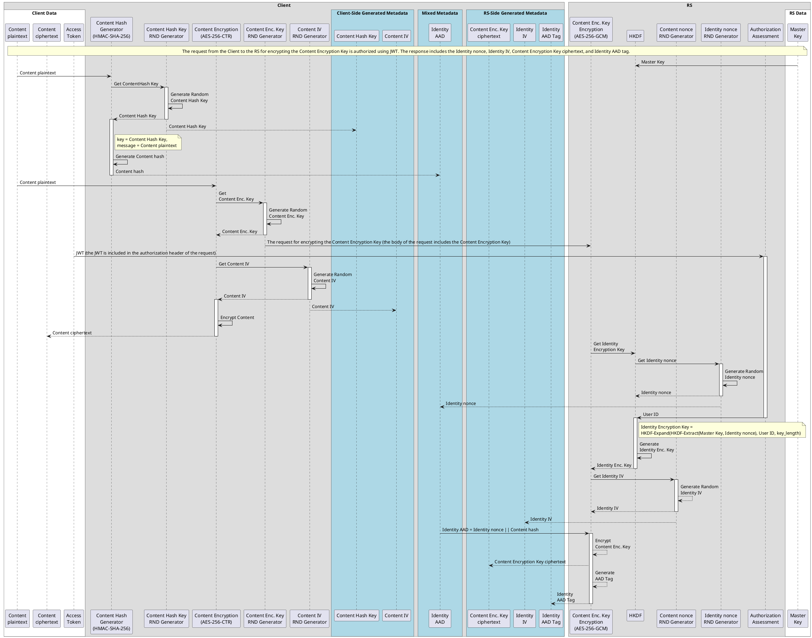
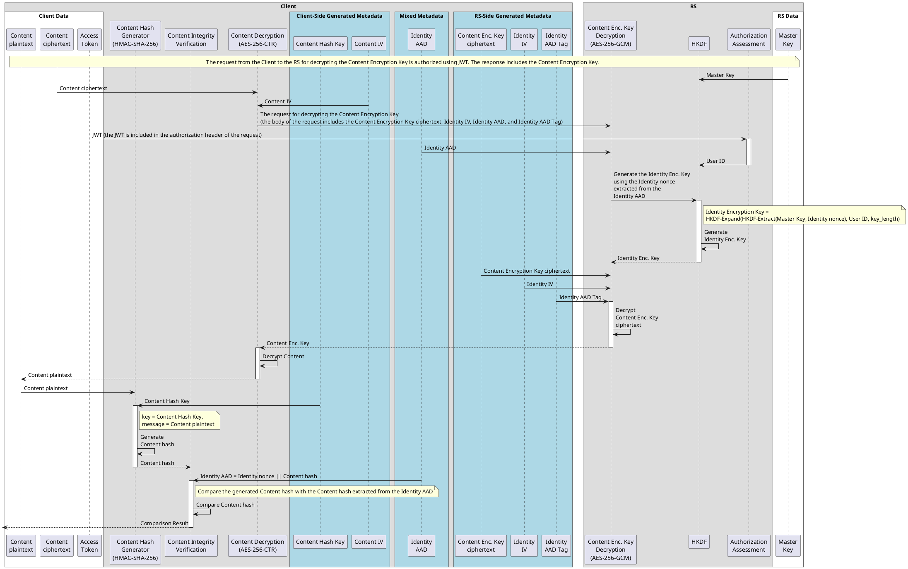

# Identity-Based Symmetric Key Cryptography Mechanisms

## Introduction

This is a set of Identity-Based Symmetric Key Cryptography Mechanisms. The client generates a content encryption key to encrypt the user's content. This key is then sent to the Resource Server for further encryption, along with the content hash and the user's ID (email address) of the individual authorized to decrypt it. The Resource Server returns the encrypted content encryption key and the corresponding metadata. To decrypt the content encryption key, the user must be authorized to access the Resource Server using an OAuth 2.0-based mechanism.

## Acronyms

* RS: Resource Server

**Sequence Diagram for Encryption:**

**Sequence Diagram for Decryption:**

The decryption process ensures that the decrypted content is indeed the original content that was encrypted for the specific user and verifies that the Resource Server processed the request correctly within the context of the intended user's identity.