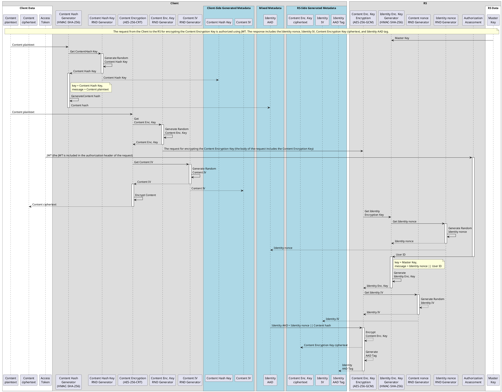
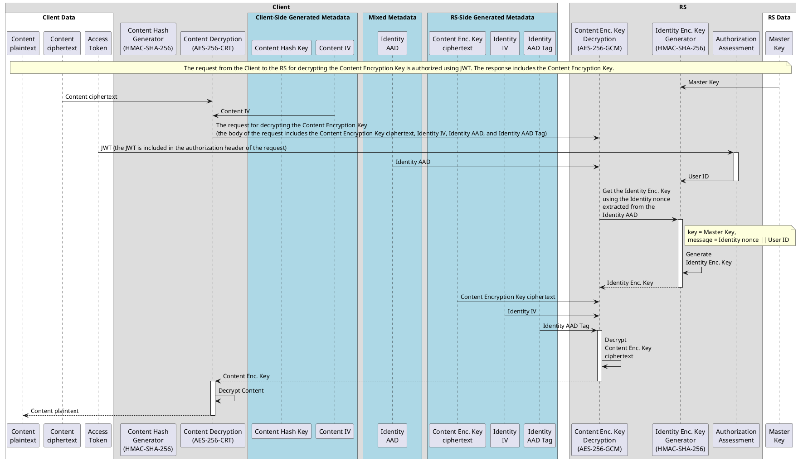

# Identity-Based Symmetric Key Cryptography Mechanisms

## Acronyms

* RS: Resource Server

**Sequence Diagram for Encryption:**

```plantuml
@startuml
!pragma teoz true

' --- Client ---
participant "Content Hash\nGenerator\n(HMAC-SHA-256)" as ContentHashGen
participant "Content Hash Key\nRND Generator" as ContentHashKeyRNDGen
participant "Content Encryption\n(AES-256-CRT)" as ContentEncryption
participant "Content Enc. Key\nRND Generator" as ContentEncKeyRNDGen
participant "Content IV\nRND Generator" as ContentIV_RNDGen

' --- Client Inputs ---
participant "Content\nplaintext" as ContentPlaintext
participant "Access\nToken" as AccessToken

' --- Client Outputs ---
participant "Content\nciphertext" as ContentCiphertext

' --- Client-Side Generated Metadata ---
participant "Content Hash Key" as ContentHashKeyMetadata
participant "Content IV" as ContentIVMetadata

' --- RS ---
participant "Identity Enc. Key\nGenerator\n(HMAC-SHA-256)" as IdentityEncKeyGen
participant "Content Enc. Key\nEncryption\n(AES-256-GCM)" as ContentEncKeyEncryption
participant "Content nonce\nRND Generator" as ContentNonceRNDGen
participant "Identity nonce\nRND Generator" as IdentityNonceRNDGen
participant "Authorization\nAssessment" as AuthorizationAssessment

' --- RS Inputs ---
participant "Master\nKey" as Masterkey

' --- RS-Side Generated Metadata ---
participant "Content Enc. Key\nciphertext" as ContentEncKeyCiphertextMetadata
participant "Identity\nAAD Tag" as IdentityAADTagMetadata
participant "Identity\nIV" as IdentityIVMetadata

' --- Mixed Metadata ---
participant "Identity\nAAD" as IdentityAADMetadata

box "Client"
    box "Client Data" #White
        participant ContentPlaintext
        participant ContentCiphertext
        participant AccessToken
    end box

    participant ContentHashGen
    participant ContentHashKeyRNDGen
    participant ContentEncryption
    participant ContentEncKeyRNDGen
    participant ContentIV_RNDGen

    box "Client-Side Generated Metadata" #LightBlue
        participant ContentHashKeyMetadata
        participant ContentIVMetadata
    end box

    box "Mixed Metadata" #LightBlue
        participant IdentityAADMetadata
    end box

    box "RS-Side Generated Metadata" #LightBlue
        participant ContentEncKeyCiphertextMetadata
        participant IdentityIVMetadata
        participant IdentityAADTagMetadata
    end box
end box

box "RS"
    participant ContentEncKeyEncryption
    participant IdentityEncKeyGen
    participant ContentNonceRNDGen
    participant IdentityNonceRNDGen
    participant AuthorizationAssessment

    box "RS Data" #White
        participant Masterkey as "Master Key"
    end box
end box

note across: The request from the Client to the RS for encrypting the Content Encryption Key is authorized using JWT. The response includes the Identity nonce, Identity IV, Content Encryption Key ciphertext, and Identity AAD tag.

Masterkey -> IdentityEncKeyGen: Master Key

' --- Content plaintext for hash generation ---
ContentPlaintext -> ContentHashGen: Content plaintext
' --- Content Hash Generation ---
ContentHashGen -> ContentHashKeyRNDGen: Get ContentHash Key
' --- Content Hash Key Generation process ---
activate ContentHashKeyRNDGen
ContentHashKeyRNDGen -> ContentHashKeyRNDGen: Generate Random\nContent Hash Key
ContentHashKeyRNDGen --> ContentHashGen: Content Hash Key
deactivate ContentHashKeyRNDGen
' --- Content Hash Generation process ---
activate ContentHashGen
ContentHashKeyRNDGen --> ContentHashKeyMetadata: Content Hash Key
note right of ContentHashGen: key = Content Hash Key,\nmessage = Content plaintext
ContentHashGen -> ContentHashGen: GenerateContent hash
ContentHashGen --> IdentityAADMetadata: Content hash
deactivate ContentHashGen

' Content plaintext for encryption
ContentPlaintext -> ContentEncryption: Content plaintext
' Content plaintext Encryption
ContentEncryption -> ContentEncKeyRNDGen: Get\nContent Enc. Key
' --- Content Encryption Key Generation process ---
activate ContentEncKeyRNDGen
ContentEncKeyRNDGen -> ContentEncKeyRNDGen: Generate Random\nContent Enc. Key
ContentEncKeyRNDGen --> ContentEncryption: Content Enc. Key
deactivate ContentEncKeyRNDGen
' --- Request for encrypting the Content Encryption Key ---
ContentEncKeyRNDGen -> ContentEncKeyEncryption: The request for encrypting the Content Encryption Key (the body of the request includes the Content Encryption Key)
' --- Request Authorization Header
AccessToken->AuthorizationAssessment: JWT (the JWT is included in the authorization header of the request)
activate AuthorizationAssessment
' --- Content plaintext IV Generation ---
ContentEncryption -> ContentIV_RNDGen: Get Content IV
' --- Content plaintext IV Generation process ---
activate ContentIV_RNDGen
ContentIV_RNDGen -> ContentIV_RNDGen: Generate Random\nContent IV
ContentIV_RNDGen --> ContentEncryption: Content IV
deactivate ContentIV_RNDGen
' --- Content plaintext Encryption process ---
activate ContentEncryption
ContentIV_RNDGen --> ContentIVMetadata: Content IV
ContentEncryption -> ContentEncryption: Encrypt Content
ContentEncryption --> ContentCiphertext: Content ciphertext
deactivate ContentEncryption

' --- Identity Enc. Key Generation ---
ContentEncKeyEncryption -> IdentityEncKeyGen: Get Identity\nEncryption Key
' --- Identity nonce Generation ---
IdentityEncKeyGen -> IdentityNonceRNDGen: Get Identity nonce
' --- Identity nonce Generation process ---
activate IdentityNonceRNDGen
IdentityNonceRNDGen -> IdentityNonceRNDGen: Generate Random\nIdentity nonce
IdentityNonceRNDGen --> IdentityEncKeyGen: Identity nonce
deactivate IdentityNonceRNDGen
' --- Response Data ---
IdentityNonceRNDGen --> IdentityAADMetadata: Identity nonce
' --- Identity Enc. Key Generation ---
AuthorizationAssessment-> IdentityEncKeyGen: User ID
deactivate AuthorizationAssessment
' --- Identity Enc. Key Generation process ---
activate IdentityEncKeyGen
note right of IdentityEncKeyGen: key = Master Key,\nmessage = Identity nonce || User ID
IdentityEncKeyGen -> IdentityEncKeyGen: Generate\nIdentity Enc. Key
IdentityEncKeyGen --> ContentEncKeyEncryption: Identity Enc. Key
deactivate IdentityEncKeyGen
' --- Identity IV Generation ---
ContentEncKeyEncryption -> ContentNonceRNDGen: Get Identity IV
' --- Identity IV Generation process ---
activate ContentNonceRNDGen
ContentNonceRNDGen --> ContentNonceRNDGen: Generate Random\nIdentity IV
ContentNonceRNDGen --> ContentEncKeyEncryption: Identity IV
deactivate ContentNonceRNDGen
' --- Response Data ---
ContentNonceRNDGen --> IdentityIVMetadata: Identity IV
' --- Content Key Encryption ---
IdentityAADMetadata -> ContentEncKeyEncryption: Identity AAD = Identity nonce || Content hash
' --- Content Key Encryption process ---
activate ContentEncKeyEncryption
ContentEncKeyEncryption --> ContentEncKeyEncryption: Encrypt\nContent Enc. Key
' --- Response Data ---
ContentEncKeyEncryption --> ContentEncKeyCiphertextMetadata: Content Encryption Key ciphertext
ContentEncKeyEncryption --> ContentEncKeyEncryption: Generate\nAAD Tag
' --- Response Data ---
ContentEncKeyEncryption --> IdentityAADTagMetadata: Identity\nAAD Tag
deactivate ContentEncKeyEncryption

@enduml
```

**Sequence Diagram for Decryption:**

```plantuml
@startuml
!pragma teoz true

' --- Client ---
participant "Content Hash\nGenerator\n(HMAC-SHA-256)" as ContentHashGen
participant "Content Decryption\n(AES-256-CRT)" as ContentDecryption

' --- Client Inputs ---
participant "Content\nplaintext" as ContentPlaintext
participant "Access\nToken" as AccessToken

' --- Client Outputs ---
participant "Content\nciphertext" as ContentCiphertext

' --- Client-Side Generated Metadata ---
participant "Content Hash Key" as ContentHashKeyMetadata
participant "Content IV" as ContentIVMetadata

' --- RS ---
participant "Identity Enc. Key\nGenerator\n(HMAC-SHA-256)" as IdentityEncKeyGen
participant "Content Enc. Key\nDecryption\n(AES-256-GCM)" as ContentEncKeyDecryption
participant "Authorization\nAssessment" as AuthorizationAssessment

' --- RS Inputs ---
participant "Master\nKey" as Masterkey

' --- RS-Side Generated Metadata ---
participant "Content Enc. Key\nciphertext" as ContentEncKeyCiphertextMetadata
participant "Identity\nAAD Tag" as IdentityAADTagMetadata
participant "Identity\nIV" as IdentityIVMetadata

' --- Mixed Metadata ---
participant "Identity\nAAD" as IdentityAADMetadata

box "Client"
    box "Client Data" #White
        participant ContentPlaintext
        participant ContentCiphertext
        participant AccessToken
    end box

    participant ContentHashGen
    participant ContentDecryption

    box "Client-Side Generated Metadata" #LightBlue
        participant ContentHashKeyMetadata
        participant ContentIVMetadata
    end box

    box "Mixed Metadata" #LightBlue
        participant IdentityAADMetadata
    end box

    box "RS-Side Generated Metadata" #LightBlue
        participant ContentEncKeyCiphertextMetadata
        participant IdentityIVMetadata
        participant IdentityAADTagMetadata
    end box
end box

box "RS"
    participant ContentEncKeyDecryption
    participant IdentityEncKeyGen
    participant AuthorizationAssessment

    box "RS Data" #White
        participant Masterkey as "Master Key"
    end box
end box

note across: The request from the Client to the RS for decrypting the Content Encryption Key is authorized using JWT. The response includes the Content Encryption Key.

Masterkey -> IdentityEncKeyGen: Master Key

' --- Content ciphertext decryption ---
ContentCiphertext -> ContentDecryption: Content ciphertext
ContentIVMetadata -> ContentDecryption: Content IV
' --- Request for decrypting the Content Encryption Key ---
ContentDecryption -> ContentEncKeyDecryption: The request for decrypting the Content Encryption Key\n(the body of the request includes the Content Encryption Key ciphertext, Identity IV, Identity AAD, and Identity AAD Tag)
' --- Request Authorization Header
AccessToken->AuthorizationAssessment: JWT (the JWT is included in the authorization header of the request)
activate AuthorizationAssessment
' --- Content Encryption Key decryption ---
IdentityAADMetadata -> ContentEncKeyDecryption: Identity AAD
AuthorizationAssessment-> IdentityEncKeyGen: User ID
deactivate AuthorizationAssessment
ContentEncKeyDecryption -> IdentityEncKeyGen: Get the Identity Enc. Key\nusing the Identity nonce\nextracted from the\nIdentity AAD
activate IdentityEncKeyGen
note right of IdentityEncKeyGen: key = Master Key,\nmessage = Identity nonce || User ID
IdentityEncKeyGen -> IdentityEncKeyGen: Generate\nIdentity Enc. Key
IdentityEncKeyGen --> ContentEncKeyDecryption: Identity Enc. Key
deactivate IdentityEncKeyGen
ContentEncKeyCiphertextMetadata -> ContentEncKeyDecryption: Content Encryption Key ciphertext
IdentityIVMetadata -> ContentEncKeyDecryption: Identity IV
IdentityAADTagMetadata -> ContentEncKeyDecryption: Identity AAD Tag
' --- Content Encryption Key decryption process ---
activate ContentEncKeyDecryption
ContentEncKeyDecryption -> ContentEncKeyDecryption: Decrypt\nContent Enc. Key\nciphertext
ContentEncKeyDecryption --> ContentDecryption: Content Enc. Key
deactivate ContentEncKeyDecryption

' --- Content plaintext decryption process ---
activate ContentDecryption
ContentDecryption -> ContentDecryption: Decrypt Content
ContentDecryption --> ContentPlaintext: Content plaintext
deactivate ContentDecryption


@enduml
```

