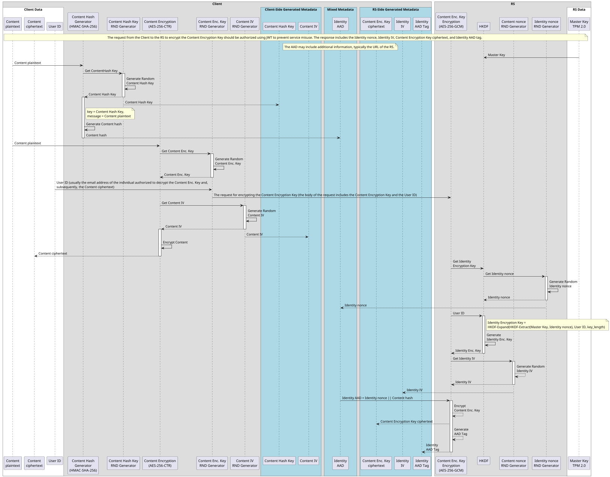
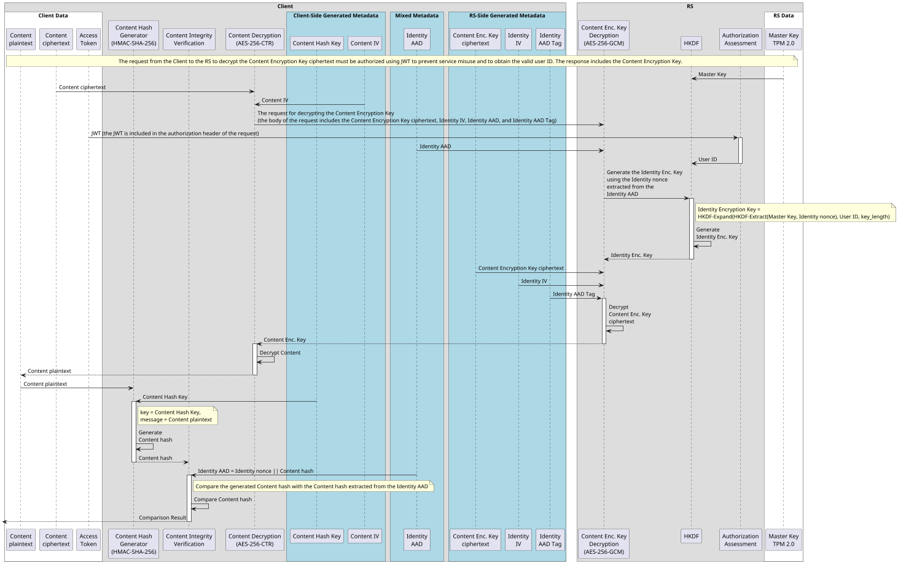
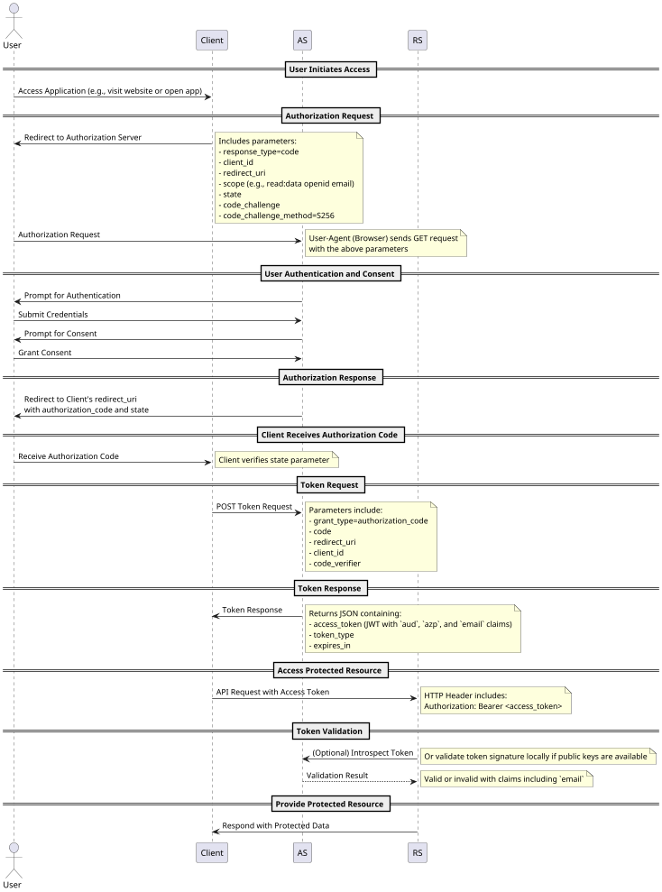

# Identity-Based Symmetric Key Cryptography

## Introduction

This is a set of Identity-Based Symmetric Key Cryptography Mechanisms. The client generates a content encryption key to encrypt the user's content. This key is then sent to the Resource Server for further encryption, along with the content hash and the user's ID (email address) of the individual authorized to decrypt it. The Resource Server returns the encrypted content encryption key and the corresponding metadata. To decrypt the content encryption key, the user must be authorized to access the Resource Server using an OAuth 2.0-based mechanism.

## Acronyms

* AS: Authorization Server
* RS: Resource Server

**Sequence Diagram for Encryption:**

**Sequence Diagram for Decryption:**

The decryption process ensures that the decrypted content is indeed the original content that was encrypted for the specific user and verifies that the Resource Server processed the request correctly within the context of the intended user's identity. The authenticity of the Content hash is ensured by the AAD Tag of the AES-256-GCM function and integrity of the Content plaintext is ensured by the HMAC-SHA-256 function.

## OAuth 2.0/OIDC PKCE Authorization Code Grant Flow with Audience Restriction and User Email Inclusion

The sequence diagram outlines a mechanism for authenticating users and authorizing access to protected resources using the OAuth 2.0 protocol, enhanced with Proof Key for Code Exchange (PKCE). 

Key enhancements in this mechanism include the utilization of the `scope` parameter to define the `aud` (audience) claim within the Access Token, thereby restricting token validity to specific RSs. This ensures that access tokens are purpose-bound, enhancing security by preventing misuse across unintended services. Additionally, the Access Token incorporates the authenticated user's email address as an `email` claim, providing the RS with a reliable identifier for personalized access controls without necessitating additional user information requests. Further strengthening the security framework, the inclusion of the `azp` (Authorized Party) claim within the Access Token binds the token to the specific project or account service ID of the application that requested the token.

The sequence begins with the user initiating access to the client application, which redirects the user to the AS with a detailed authorization request containing parameters such as `scope`, `state`, and PKCE-related values (`code_challenge` and `code_challenge_method`). Upon successful authentication and user consent, the AS issues an Access Token. The Access Token, enriched with the `aud`, `azp`, and `email` claims, is then utilized by the client application to access protected resources from the RS. It is essential that the RS is properly configured initially to correctly evaluate these claims. The RS validates the token's integrity, audience, and extracts the user's email to manage access appropriately.

## Autorization and Identity-Based Symmetric Key Cryptography Mechanisms

In illustrative unrestricted mode, anyone can access the RS and encrypt content for others. However, during the decryption process, authorization is required, and a valid access token with the appropriate claims must be provided. This illustrative mode highlights a specific feature – the decoupling of the encryption initiation from immediate authorization checks at the RS.

## Keyring as an Authorization Server for Content Plaintext Access

In this system, the Content Encryption Key is the key to accessing the Content plaintext. Therefore, controlling access to the Content Encryption Key is effectively controlling access to the Content plaintext.

* Wrapping the Content Encryption Key can be seen as preparing the key for authorized access later. It's setting the stage for future authorization.

* Unwrapping the Content Encryption Key is granting access to the Content Encryption Key, which in turn grants access to the Content plaintext. The Keyring decides if and when to perform this unwrapping based on authorization checks.

The Keyring provides the central authorization functions and can therefore be regarded and treated as an Authorization Server. Because of this analogy, it is highly beneficial to apply the same best practices used for managing OAuth 2.0 Authorization Servers to the management of the Keyring.

**Keyring Management Best Practices (Inspired by AS Best Practices):**

* **Admin Interface (Console/Web Application):**
    * **Configuration Management:** Provide a secure admin interface (web-based or console) to configure the Keyring. This includes:
        * Master Key management (initialization, rotation, version tracking).
        * Trusted Authorization Server (AS) configurations (for JWT validation - trust anchors, JWKS endpoints, expected audiences, authorized parties).
        * Audit logging configuration.
        * Security policies and parameters.
    * **Monitoring and Logging:** Implement robust monitoring dashboards and logging capabilities within the admin interface to track Keyring health, performance, security events, and audit trails.
* **Metadata Endpoints (Configuration Discovery):**
    * **Discovery Endpoint (Similar to OIDC Discovery):** Consider providing a metadata endpoint (e.g., `/.well-known/keyring-configuration`) that exposes configuration details about the Keyring, such as:
        * Encryption and decryption endpoint URLs.
        * Supported cryptographic algorithms (AES-256-GCM, AES-256-CTR, HMAC-SHA-256, HKDF).
        * URLs of trusted Authorization Servers (JWKS endpoints).
        * Key rotation policy (e.g., rotation frequency).
        * Service documentation links.
    * **Purpose:** This metadata endpoint allows clients and administrators to programmatically discover and verify the Keyring's configuration, making integration and management easier and more transparent.
* **Role-Based Access Control (RBAC) for Keyring Admin:** Implement strong Role-Based Access Control for the Keyring admin interface.  Restrict access to sensitive administrative functions (like Master Key management, AS configuration) to only authorized administrators with proper credentials.
* **Secure Deployment and Hardening:** Apply security hardening best practices to the Keyring server infrastructure:
    * Secure operating system configuration.
    * Firewall rules and network segmentation.
    * Regular security patching and updates.
    * Intrusion detection and prevention systems.
* **Audit Logging and Security Monitoring:** Comprehensive audit logging of all Keyring operations (especially administrative actions, key management events, and authorization decisions).  Implement security monitoring and alerting to detect and respond to suspicious activities.
* **Rate Limiting and DoS Protection:** Implement rate limiting and other DoS protection mechanisms to prevent abuse of the Keyring's encryption and decryption endpoints.

## Real-World Scenario

We illustrate the process of securely sharing data between Alice and Bob, where Alice wants to share a vacation photo with Bob.

### Prerequisites

Alice uses an application (Client) that allows her authenticate via the Authorization Server (AS) and store, retrieve, and share encrypted files on the remote data store (RS1). Additionally, the Client has access to the remote keyring (RS2), which provides identity-based cryptographic functions.  The Client has simultaneous access to both the RS1 and RS2. Alice also knows that Bob can obtain authorized access to RS1 and RS2.

Notes:

* The interaction with RS1 is not detailed in this proposal and is considered out of scope.
* In this context, RS2 represents RS in the provided sequence diagrams.
* The Client application acts as the intermediary, interacting with both RS1 and RS2.

### Use Case

Alice opens her vacation photo in the Client and enters Bob's email address in the "Share with:" field. She then clicks the "Share" button. The Client encrypts the photo on the client side using RS2's identity-based cryptographic functions and stores the encrypted photo along with its metadata in RS1.

Afterward, Alice notifies Bob that he can access the photo by sending him a shared link to the encrypted file stored in RS1.

Bob can open the shared link after authenticating via AS. His Client retrieves the encrypted photo along with its metadata from RS1, and decrypts it on the client side using RS2's identity-based cryptographic functions. Finally Bob saves the decrypted photo to his local storage.

Notes:

* The encrypted files and associated metadata from the encryption process are persistently stored on RS1 by the Client.
* The keyring can input its URL into the Identity AAD (Identity AAD = Identity nonce || Content hash || Keyring URL) before wrapping the Content Encryption Key. As a result, the Client knows which remote keyring must be used to unwrap the Content Encryption Key ciphertext. This allows Alice to use her dedicated remote keyring, RS2, to encrypt her vacation photo shared with Bob, while Bob can use his remote keyring, RS3, to encrypt his vacation photo shared with Alice, both users using the same remote data store, RS1.
* Alice can have a single dedicated remote Keyring and use multiple sharing services, such as (a) a remote photo store and (b) a remote document repository, each with its own AS provider and respective registered Client. With a properly configured Keyring, and both Clients having Alice's Keyring URL set in their account configuration, such a setup will work without any issues. As long as Bob is registered with both services, Alice can share an encrypted photo and document with him using her single remote Keyring.

### Summary

In essence, RS2, RS3 are the crypto engines and key managers, while RS1 is the data and metadata repository. The Client orchestrates the interaction between them.

## Conclusion

Overall, the proposal presents a robust framework for secure content sharing using identity-based encryption and modern cryptographic practices.

TBD