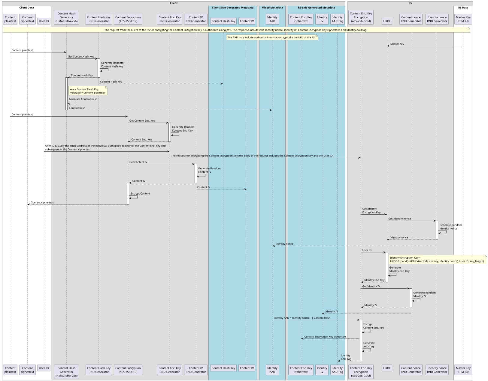

# Identity-Based Symmetric Key Cryptography Mechanisms

## Introduction

This is a set of Identity-Based Symmetric Key Cryptography Mechanisms. The client generates a content encryption key to encrypt the user's content. This key is then sent to the Resource Server for further encryption, along with the content hash and the user's ID (email address) of the individual authorized to decrypt it. The Resource Server returns the encrypted content encryption key and the corresponding metadata. To decrypt the content encryption key, the user must be authorized to access the Resource Server using an OAuth 2.0-based mechanism.

## Acronyms

* AS: Authorization Server
* RS: Resource Server

**Sequence Diagram for Encryption:**

**Sequence Diagram for Decryption:**

The decryption process ensures that the decrypted content is indeed the original content that was encrypted for the specific user and verifies that the Resource Server processed the request correctly within the context of the intended user's identity. The authenticity of the Content hash is ensured by the AAD Tag of the AES-256-GCM function and integrity of the Content plaintext is ensured by the HMAC-SHA-256 function

## OAuth 2.0/OIDC PKCE Authorization Code Grant Flow with Audience Restriction and User Email Inclusion

The sequence diagram outlines a mechanism for authenticating users and authorizing access to protected resources using the OAuth 2.0 protocol, enhanced with Proof Key for Code Exchange (PKCE). 

Key enhancements in this mechanism include the utilization of the `scope` parameter to define the `aud` (audience) claim within the Access Token, thereby restricting token validity to specific RSs. This ensures that access tokens are purpose-bound, enhancing security by preventing misuse across unintended services. Additionally, the Access Token incorporates the authenticated user's email address as an `email` claim, providing the RS with a reliable identifier for personalized access controls without necessitating additional user information requests. Further strengthening the security framework, the inclusion of the `azp` (Authorized Party) claim within the Access Token binds the token to the specific project or account service ID of the application that requested the token.

The sequence begins with the user initiating access to the client application, which redirects the user to the AS with a detailed authorization request containing parameters such as `scope`, `state`, and PKCE-related values (`code_challenge` and `code_challenge_method`). Upon successful authentication and user consent, the AS issues an Access Token. The Access Token, enriched with the `aud`, `azp`, and `email` claims, is then utilized by the client application to access protected resources from the RS. The RS validates the token's integrity, audience, and extracts the user's email to manage access appropriately.

## Autorization and Identity-Based Symmetric Key Cryptography Mechanisms

In unrestricted mode, anyone can access the RS and encrypt content for others. However, during the decryption process, authorization is required, and a valid access token with the appropriate claims must be provided.

## Real-World Scenario

We illustrate the process of securely sharing data between Alice and Bob, where Alice wants to share a vacation photo with Bob.

### Prerequisites

Alice uses an application (Client) that allows her authenticate via the Authorization Server (AS) and store, retrieve, and share encrypted files on the remote data store (RS1). Additionally, the Client has access to the remote keyring (RS2), which provides identity-based cryptographic functions.  The Client has simultaneous access to both the RS1 and RS2. Alice also knows that Bob can obtain authorized access to RS1 and RS2. 

### Use Case

Alice opens her vacation photo in the Client and enters Bob's email address in the "Share with:" field. She then clicks the "Share" button. The Client encrypts the photo on the client side using RS2's identity-based cryptographic functions and stores the encrypted photo along with its metadata in RS1.

Afterward, Alice notifies Bob that he can access the photo by sending him a shared link to the encrypted file stored in RS1.

Bob can open the shared link after authenticating via AS. His Client retrieves the encrypted photo along with its metadata from RS1, and decrypts it on the client side using RS2's identity-based cryptographic functions. Finally Bob saves the decrypted photo to his local storage.

## Conclusion

TBD