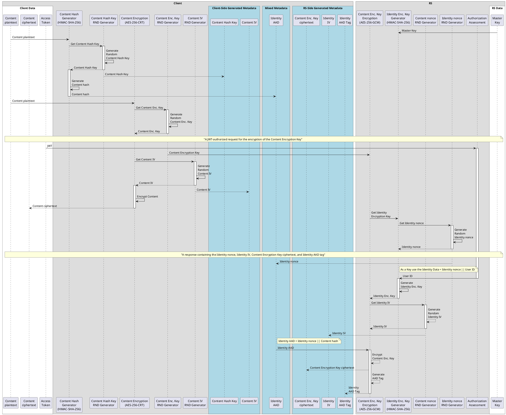

# Identity-Based Symmetric Key Encryption Mechanisms

## Acronyms

* RS: Resource Server

**Sequence Diagram for Encryption:**

```plantuml
@startuml
!pragma teoz true

' --- Client ---
participant "Content Hash\nGenerator\n(HMAC-SHA-256)" as ContentHashGen
participant "Content Hash Key\nRND Generator" as ContentHashKeyRNDGen
participant "Content Encryption\n(AES-256-CRT)" as ContentEncryption
participant "Content Enc. Key\nRND Generator" as ContentEncKeyRNDGen
participant "Content IV\nRND Generator" as ContentIV_RNDGen

' --- Client Inputs ---
participant "Content\nplaintext" as ContentPlaintext
participant "Access\nToken" as AccessToken

' --- Client Outputs ---
participant "Content\nciphertext" as ContentCiphertext

' --- Client-Side Generated Metadata ---
participant "Content Hash Key" as ContentHashKeyMetadata
participant "Content IV" as ContentIVMetadata

' --- RS ---
participant "Identity Enc. Key\nGenerator\n(HMAC-SHA-256)" as IdentityEncKeyGen
participant "Content Enc. Key\nEncryption\n(AES-256-GCM)" as ContentEncKeyEncryption
participant "Content nonce\nRND Generator" as ContentNonceRNDGen
participant "Identity nonce\nRND Generator" as IdentityNonceRNDGen
participant "Authorization\nAssessment" as AuthorizationAssessment

' --- RS Inputs ---
participant "Master\nKey" as Masterkey

' --- RS-Side Generated Metadata ---
participant "Content Enc. Key\nciphertext" as ContentEncKeyCiphertextMetadata
participant "Identity\nAAD Tag" as IdentityAADTagMetadata
participant "Identity\nIV" as IdentityIVMetadata

' --- Mixed Metadata ---
participant "Identity\nAAD" as IdentityAADMetadata

box "Client"
    box "Client Data" #White
        participant ContentPlaintext
        participant ContentCiphertext
        participant AccessToken
    end box

    participant ContentHashGen
    participant ContentHashKeyRNDGen
    participant ContentEncryption
    participant ContentEncKeyRNDGen
    participant ContentIV_RNDGen

    box "Client-Side Generated Metadata" #LightBlue
        participant ContentHashKeyMetadata
        participant ContentIVMetadata
    end box

    box "Mixed Metadata" #LightBlue
        participant IdentityAADMetadata
    end box

    box "RS-Side Generated Metadata" #LightBlue
        participant ContentEncKeyCiphertextMetadata
        participant IdentityIVMetadata
        participant IdentityAADTagMetadata
    end box
end box

box "RS"
    participant ContentEncKeyEncryption
    participant IdentityEncKeyGen
    participant ContentNonceRNDGen
    participant IdentityNonceRNDGen
    participant AuthorizationAssessment

    box "RS Data" #White
        participant Masterkey as "Master Key"
    end box
end box

Masterkey -> IdentityEncKeyGen: Master Key

' --- Content plaintext for hash generation ---
ContentPlaintext -> ContentHashGen: Content plaintext
' --- Content Hash Generation ---
ContentHashGen -> ContentHashKeyRNDGen: Get Content Hash Key
' --- Content Hash Key Generation process ---
activate ContentHashKeyRNDGen
ContentHashKeyRNDGen -> ContentHashKeyRNDGen: Generate\nRandom\nContent Hash Key
ContentHashKeyRNDGen --> ContentHashGen: Content Hash Key
deactivate ContentHashKeyRNDGen
' --- Content Hash Generation process ---
activate ContentHashGen
ContentHashKeyRNDGen --> ContentHashKeyMetadata: Content Hash Key
ContentHashGen -> ContentHashGen: Generate\nContent hash
ContentHashGen --> IdentityAADMetadata: Content hash
deactivate ContentHashGen

' Content plaintext for encryption
ContentPlaintext -> ContentEncryption: Content plaintext
' Content plaintext Encryption
ContentEncryption -> ContentEncKeyRNDGen: Get Content Enc. Key
' --- Content Encryption Key Generation process ---
activate ContentEncKeyRNDGen
ContentEncKeyRNDGen -> ContentEncKeyRNDGen: Generate\nRandom\nContent Enc. Key
ContentEncKeyRNDGen --> ContentEncryption: Content Enc. Key
deactivate ContentEncKeyRNDGen
' --- Request ---
note across: "A JWT-authorized request for the encryption of the Content Encryption Key"
AccessToken->AuthorizationAssessment: JWT
activate AuthorizationAssessment
ContentEncKeyRNDGen -> ContentEncKeyEncryption: Content Encryption Key
' --- Content plaintext IV Generation ---
ContentEncryption -> ContentIV_RNDGen: Get Content IV
' --- Content plaintext IV Generation process ---
activate ContentIV_RNDGen
ContentIV_RNDGen -> ContentIV_RNDGen: Generate\nRandom\nContent IV
ContentIV_RNDGen --> ContentEncryption: Content IV
deactivate ContentIV_RNDGen
' --- Content plaintext Encryption process ---
activate ContentEncryption
ContentIV_RNDGen --> ContentIVMetadata: Content IV
ContentEncryption -> ContentEncryption: Encrypt Content
ContentEncryption --> ContentCiphertext: Content ciphertext
deactivate ContentEncryption

' --- Identity Enc. Key Generation ---
ContentEncKeyEncryption -> IdentityEncKeyGen: Get Identity\nEncryption Key
' --- Identity nonce Generation ---
IdentityEncKeyGen -> IdentityNonceRNDGen: Get Identity nonce
' --- Identity nonce Generation process ---
activate IdentityNonceRNDGen
IdentityNonceRNDGen -> IdentityNonceRNDGen: Generate\nRandom\nIdentity nonce
IdentityNonceRNDGen --> IdentityEncKeyGen: Identity nonce
deactivate IdentityNonceRNDGen
note across: "A response containing the Identity nonce, Identity IV, Content Encryption Key ciphertext, and Identity AAD tag"
' --- Response ---
IdentityNonceRNDGen --> IdentityAADMetadata: Identity nonce
' ???
note right of IdentityEncKeyGen: As a Key use the Identity Data = Identity nonce || User ID
AuthorizationAssessment-> IdentityEncKeyGen: User ID
deactivate AuthorizationAssessment
' --- Identity Enc. Key Generation process ---
activate IdentityEncKeyGen
IdentityEncKeyGen -> IdentityEncKeyGen: Generate\nIdentity Enc. Key
IdentityEncKeyGen --> ContentEncKeyEncryption: Identity Enc. Key
deactivate IdentityEncKeyGen
' --- Identity IV Generation ---
ContentEncKeyEncryption -> ContentNonceRNDGen: Get Identity IV
' --- Identity IV Generation process ---
activate ContentNonceRNDGen
ContentNonceRNDGen --> ContentNonceRNDGen: Generate\nRandom\nIdentity IV
ContentNonceRNDGen --> ContentEncKeyEncryption: Identity IV
deactivate ContentNonceRNDGen
' --- Response ---
ContentNonceRNDGen --> IdentityIVMetadata: Identity IV
' --- Content Key Encryption ---
note right of IdentityAADMetadata: Identity AAD = Identity nonce || Content hash
IdentityAADMetadata -> ContentEncKeyEncryption: Identity AAD
' --- Content Key Encryption process ---
activate ContentEncKeyEncryption
ContentEncKeyEncryption --> ContentEncKeyEncryption: Encrypt\nContent Enc. Key
' --- Response ---
ContentEncKeyEncryption --> ContentEncKeyCiphertextMetadata: Content Encryption Key ciphertext
ContentEncKeyEncryption --> ContentEncKeyEncryption: Generate\nAAD Tag
' --- Response ---
ContentEncKeyEncryption --> IdentityAADTagMetadata: Identity\nAAD Tag
deactivate ContentEncKeyEncryption

@enduml
```

